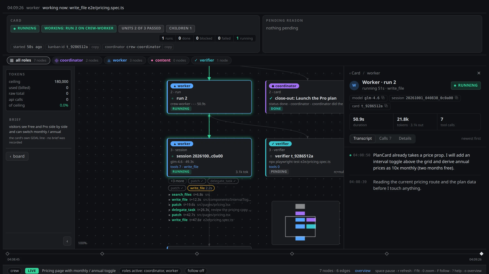

# Hermes.Crew

**You ask once. A coordinator owns the card until its proof passes.**

[](https://github.com/NousResearch/hermes-agent)
[](plugin.yaml)
[](LICENSE)
[](https://www.python.org/)
[](https://crew.forgecoreai.com)


[Website](https://crew.forgecoreai.com) · [Watch the 53 s film](https://crew.forgecoreai.com/#board) · [Install](#install) · [Reference](REFERENCE.md)

---

Crew is a plugin for [Hermes Agent](https://github.com/NousResearch/hermes-agent) that turns one chat
message into verified work on the Hermes kanban board.

```
/crew launch the Pro plan: pricing page, Stripe checkout, launch post and email
```

Crew asks only what it needs to deliver a good result (five questions at most, often none), writes a
**card contract** - goal, artifact, where it lands, *done when*, a **proof command**, a token budget - and
hands the card to a **coordinator** that owns it until the proof command exits 0. You get the verified
result back in the same chat, or one concrete question when it truly needs you.

[](https://crew.forgecoreai.com)

## Why

| | |
|---|---|
| **One ask** | `/crew <ask>` is the only thing you type. Normal chat stays untouched. |
| **Up to six cards in parallel** | One ask fans out into independent cards, one writer each. |
| **Done means proven** | A card cannot be marked done until its proof command passes - enforced by a tool guard, in every profile. |
| **An owner for every card** | The coordinator heals, retries, rescopes or splits a stuck card, and asks you only when it needs you. |
| **Hard budgets** | Every card carries a token budget; a run that reaches it stops instead of burning on. |
| **See everything** | A local dashboard shows every card, run, session, tool call and verdict, live. |
| **Self-hosted** | Runs inside your own Hermes, on your own machine. No telemetry. |

## Install

Requires Hermes Agent with the kanban board, and Python 3.11+.

```sh
# 1. get the plugin
hermes plugins install macd2/crew

# 2. set it up for your chat profile (role profiles, services, the nightly proofs)
python3 ~/.hermes/plugins/crew/install.py --profile NAME

# 3. check it
python3 ~/.hermes/plugins/crew/install.py --check --profile NAME
hermes -p NAME plugins doctor crew
```

`NAME` is the profile you chat with (`default` if you do not use profiles). Running the installer twice
changes nothing; `--check` is a dry run that prints exactly what would change.

The installer creates four role profiles from `templates/profiles/` - `crew-coordinator`, `crew-worker`,
`crew-content`, `crew-verifier` - each with its own persona, model and tools (Anthropic models by default:
edit `templates/profiles/<role>/settings.conf` before installing to use your own), and two user services:

- **`crew-graph-http`** - the dashboard on `http://127.0.0.1:8799/`
  (`--graph-port N` to change; `--publish` also serves it over your tailnet with `tailscale serve`)
- **`kanban-zulip-feed`** - optional live card feed into a Zulip stream (`--no-service` skips both)

## Use

| Command | What it does |
|---|---|
| `/crew <ask>` | The intake: asks what is missing, writes the contract, opens the card(s). |
| `/crew-status` | Cards in flight, the coordinator's last decision, any question for you. No model call. |
| `/crew-graph <card\|latest>` | One card's flow graph in the terminal (`--watch N`, `--html`). No model call. |
| `/crew-stop [<card>]` | Stop one card, or every open card, and keep it down. No model call. |
| `/crew-diagnose [state]` | Read-only: every card in that state, why it is there and how it would resume. |

Or paste this into an agent and let it set crew up for you:

```
Set up Hermes.Crew for my Hermes profile NAME: from the Hermes.Crew package run python3 install.py --profile NAME,
then hermes -p NAME plugins doctor crew and fix anything it reports. Finish by sending /crew-status in my chat
and tell me what it answered.
```

## How a card travels

```
you ──/crew──▶ intake ──contract──▶ coordinator ──▶ writer (worker | content) ──▶ proof ──▶ verifier ──▶ you
                (asks what is        (owns the card,    (one per card,            (exit 0 is    (runs the proof
                 missing, once)       every stop gets    inside the scope)         the only      itself, never
                                      one decision)                                pass)         trusts a summary)
```

The full design - the contract fields, the close rule, verification modes, the coordinator's decisions,
the dashboard and the role profiles - is in [REFERENCE.md](REFERENCE.md).

## Configuration

Everything works with no configuration. Optional environment variables:

| Variable | Default | Meaning |
|---|---|---|
| `CREW_OWNER_PROFILE` | the profile `install.py` was run for | the chat profile cards are opened from and reported to |
| `CREW_DASHBOARD_URL` | `http://127.0.0.1:8799` (or the `--publish` URL) | the board link used in messages |
| `ZULIP_SITE`, `ZULIP_BOT_EMAIL`, `ZULIP_API_KEY` | - | enable the Zulip feed (in the owner profile's `.env`) |
| `KANBAN_FEED_STREAM` | `Kanban` | the Zulip stream the feed posts to |

## Uninstall

```sh
hermes plugins disable crew && hermes plugins remove crew
systemctl --user disable --now crew-graph-http.service kanban-zulip-feed.service
```

The role profiles stay until you remove them (`hermes profile delete crew-worker`, ...).

## License

[Apache-2.0](LICENSE) © macd2
